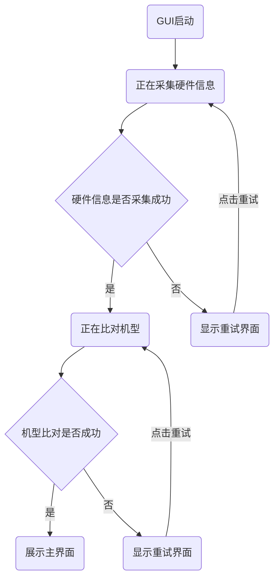

```mermaid
graph TD;
    A(GUI启动)-->B(正在采集硬件信息);
    B-->C{硬件信息是否采集成功};
    C--是-->D(正在比对机型);
    C--否-->CC(显示重试界面);
    CC--点击重试-->B
    D-->E{机型比对是否成功};
    E--是-->F(展示主界面);
    E--否-->G(显示重试界面);
    G--点击重试-->D
```